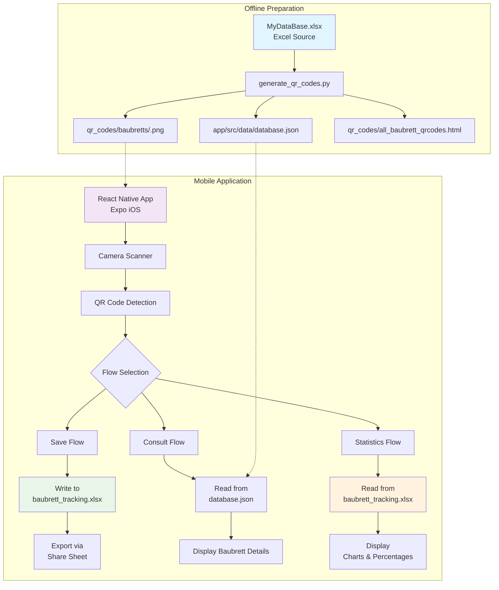
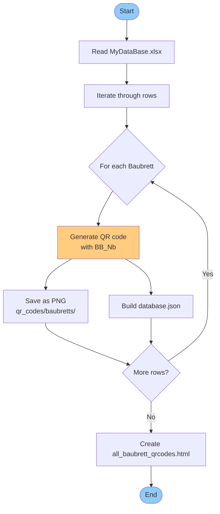
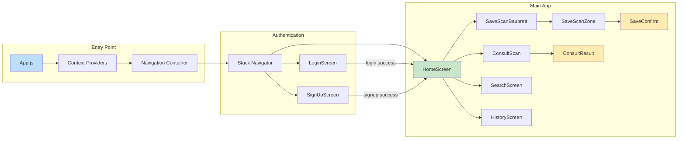
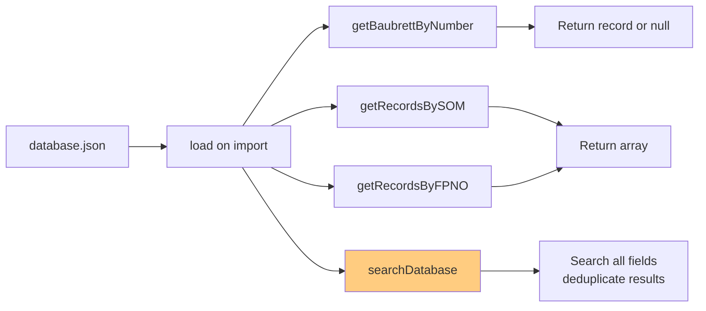
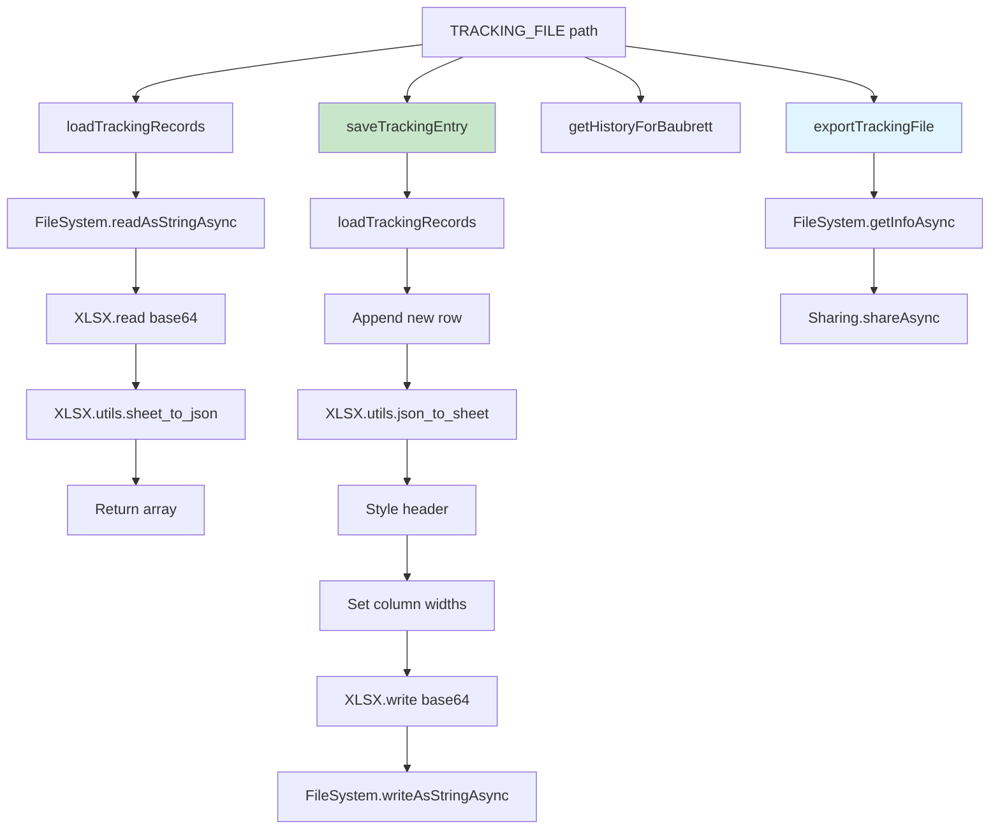
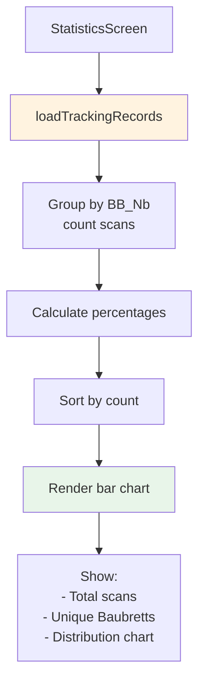
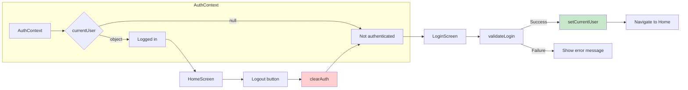
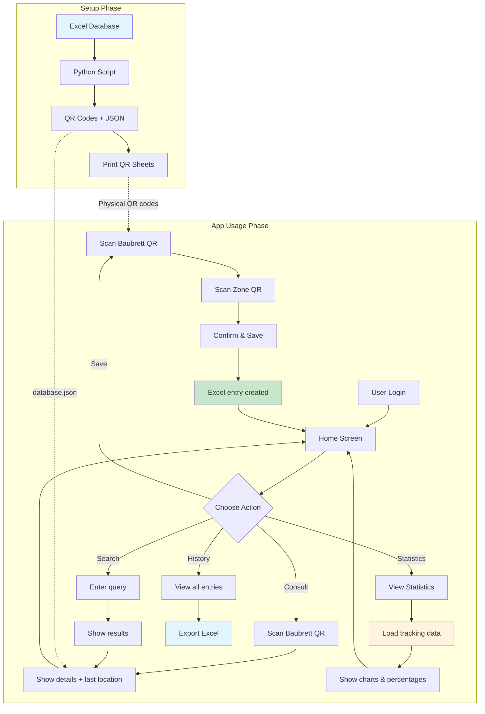

# Baubrett Tracker - System Workflow Schematic

## Project Overview

**Baubrett Tracker** is a mobile QR-code tracking system for cable boards (Baubretts) used in Mercedes-Benz assembly. The system consists of:

- **QR Code Generation** (Python) - Converts Excel database to scannable QR codes
- **Mobile App** (React Native + Expo) - Scans QR codes and tracks Baubrett locations
- **Local Excel Tracking** - Persists location history on the device

---

## System Architecture



---

## Part 1: QR Code Generation Workflow

### Process Flow



### Key Files Generated

- **`qr_codes/baubretts/073043546.png`** — Individual QR codes for each Baubrett (PNG images, 17 total)
- **`qr_codes/all_baubrett_qrcodes.html`** — Printable sheet of all QR codes (HTML, open in browser and print)
- **`app/src/data/database.json`** — App's local database (JSON with BB_Nb, SOM, FP_NO, Accessories)

---

## Part 2: Mobile App Workflow

### App Structure



### Navigation Flow

```
┌─────────────────────────────────────────────────────────────┐
│                     Stack Navigator                        │
├─────────────────────────────────────────────────────────────┤
│  1. Login (no header)                                      │
│  2. SignUp (no header)                                     │
│  3. Home ──────────┬→ SaveScanBaubrett → SaveScanZone →   │
│                    │   SaveConfirm                          │
│                    │                                        │
│                    ├→ ConsultScan → ConsultResult         │
│                    │                                        │
│                    ├→ Search                               │
│                    │                                        │
│                    ├→ Statistics                           │
│                    │                                        │
│                    └→ History                              │
└─────────────────────────────────────────────────────────────┘
```

---

## Flow 1: Save a Baubrett (3-Step Process)

### Detailed Workflow

```mermaid
flowchart TD
    Start([Home Screen]) --> TapSave[Tap "Save Baubrett"]
    TapSave --> ScanBB[Scan Baubrett QR]
    ScanBB --> ValidateBB{Validate<br/>BB_Nb in<br/>database.json?}
    ValidateBB -->|No| ErrorBB[Show "Unknown Baubrett"] --> ScanBB
    ValidateBB -->|Yes| ScanZone[Scan Zone QR]
    ScanZone --> ValidateZone{Validate<br/>Zone in<br/>zones.js?}
    ValidateZone -->|No| ErrorZone[Show "Invalid Zone"] --> ScanZone
    ValidateZone -->|Yes| ShowConfirm[Show Confirm Screen]
    ShowConfirm --> DisplaySummary[Display:<br/>- BB_Nb<br/>- Zone<br/>- Date/Time<br/>- User]
    DisplaySummary --> TapConfirm[Tap "Confirm & Save"]
    TapConfirm --> WriteExcel[Write to<br/>baubrett_tracking.xlsx]
    WriteExcel --> Success[Show Success Screen]
    Success --> Options{Choose Action}
    Options -->|Scan Another| ScanBB
    Options -->|Go Home| Home
    Options -->|View History| History
    
    style Start fill:#e3f2fd
    style Success fill:#e8f5e9
    style WriteExcel fill:#fff3e0
```

### Data Written to Excel

**File**: `baubrett_tracking.xlsx` (stored in app's Documents folder)

- **`BB_Nb`** — Scanned QR code (e.g., "073043546")
- **`Zone`** — Scanned Zone QR (e.g., "ZONE_A", "UFB03")
- **`Date`** — Current date (DD/MM/YYYY, French locale)
- **`Time`** — Current time (HH:MM, 24h, French locale)
- **`UserName`** — Authenticated user (from AuthContext)
- **`UserEmail`** — Authenticated user (from AuthContext)

---

## Flow 2: Consult a Baubrett (2-Step Process)

### Detailed Workflow

```mermaid
flowchart TD
    Start([Home Screen]) --> TapConsult[Tap "Consult Baubrett"]
    TapConsult --> ScanBB[Scan Baubrett QR]
    ScanBB --> ValidateBB{Validate<br/>BB_Nb in<br/>database.json?}
    ValidateBB -->|No| ErrorBB[Show "Unknown Baubrett"] --> ScanBB
    ValidateBB -->|Yes| LoadDB[Load record from<br/>database.json]
    LoadDB --> LoadHistory[Load tracking history<br/>from Excel]
    LoadHistory --> ShowResult[Show Result Screen]
    ShowResult --> DisplayInfo[Display:<br/>- BB_Nb & SOM<br/>- Last known location<br/>- FP-NO list<br/>- Accessories list]
    DisplayInfo --> Options{Choose Action}
    Options -->|Scan Another| ScanBB
    Options -->|View History| HistoryFiltered[History<br/>filtered to BB_Nb]
    Options -->|Go Home| Home
    
    style Start fill:#e3f2fd
    style ShowResult fill:#e8f5e9
    style LoadDB fill:#fff3e0
```

### Data Displayed from database.json

Each Baubrett record contains:

```json
{
  "BB_Nb": "073043546",
  "SOM": "SOM_REF_12345",
  "FP_NO": ["FP-001", "FP-002", ...],
  "Accessories": ["Cable", "Connector", ...]
}
```

**Last Location** is read from `baubrett_tracking.xlsx`:
- Most recent entry for that BB_Nb
- Shows: Zone, Date, Time, UserName, UserEmail

---

## Flow 3: Search Database

### Universal Search

```mermaid
flowchart TD
    Start([Home Screen]) --> TapSearch[Tap "Search Database"]
    TapSearch --> EnterQuery[Enter search query]
    EnterQuery --> SearchDB[searchDatabase(query)]
    SearchDB --> CheckType{Detect Type}
    CheckType -->|BB_Nb| MatchBB[Exact match on BB_Nb]
    CheckType -->|SOM| MatchSOM[Exact match on SOM]
    CheckType -->|FP-NO| MatchFP[Match in FP_NO array]
    MatchBB --> Results[Show results list]
    MatchSOM --> Results
    MatchFP --> Results
    Results --> TapResult[Tap a result]
    TapResult --> ShowDetails[Show Baubrett details<br/>same as ConsultResult]
    ShowDetails --> Options{Choose Action}
    Options -->|New Search| EnterQuery
    Options -->|View History| HistoryFiltered
    Options -->|Go Home| Home
    
    style SearchDB fill:#fff3e0
    style Results fill:#e8f5e9
```

**Search Priority**: BB_Nb (exact) → SOM (exact, case-insensitive) → FP-NO (exact in array)

---

## Flow 4: Statistics

### Statistics Screen Workflow

```mermaid
flowchart TD
    Start([Navigate to Statistics]) --> LoadExcel[Load baubrett_tracking.xlsx]
    LoadExcel --> Parse[Parse all rows]
    Parse --> Group[Group by BB_Nb<br/>count occurrences]
    Group --> CalcPercent[Calculate percentages]
    CalcPercent --> Sort[Sort by count descending]
    Sort --> RenderChart[Render bar chart]
    RenderChart --> Display[Display:<br/>- Total scans<br/>- Unique Baubretts<br/>- Bar chart with percentages]
    Display --> TapRefresh[Tap "Refresh"]
    TapRefresh --> LoadExcel
    
    style LoadExcel fill:#fff3e0
    style RenderChart fill:#e8f5e9
```

**Chart Features**:
- Horizontal bar chart showing scan count per Baubrett
- Bars sized proportionally to the highest count
- Shows both absolute count and percentage
- Sorted by most scanned first
- Color-coded: first Baubrett in primary color, others in lighter shade

---

## Flow 5: History & Export

### History Screen Workflow

```mermaid
flowchart TD
    Start([Navigate to History]) --> LoadExcel[Load baubrett_tracking.xlsx]
    LoadExcel --> Parse[Parse all rows]
    Parse --> Sort[Sort by Date/Time<br/>newest first]
    Sort --> Filter{Filter?}
    Filter -->|Yes, from ConsultResult| FilterBB[Filter to specific BB_Nb]
    Filter -->|No| ShowAll[Show all entries]
    FilterBB --> Display[Display list:<br/>- BB_Nb<br/>- Zone<br/>- Date & Time]
    ShowAll --> Display
    Display --> TapExport[Tap "Export"]
    TapExport --> Share[iOS Share Sheet]
    Share --> Options{AirDrop/Email/Save}
    Options -->|AirDrop| Mac[Send to Mac]
    Options -->|Email| Email[Send as attachment]
    Options -->|Save to Files| Files[Save locally]
    
    style LoadExcel fill:#fff3e0
    style Share fill:#e1f5fe
```

---

## Data Persistence

### File Storage Locations

```mermaid
graph TB
    subgraph "Device Storage"
        dir[App Documents Directory] --> tracking[baubrett_tracking.xlsx]
        dir --> cache[Cache (temporary)]
    end
    
    tracking -->|Read| LoadTracking[trackingService.loadTrackingRecords]
    tracking -->|Write| SaveTracking[trackingService.saveTrackingEntry]
    tracking -->|Export| ShareTracking[trackingService.exportTrackingFile]
    
    style tracking fill:#f3e5f5
    style SaveTracking fill:#ffecb3
```

### Excel File Structure

**Sheet Name**: `Tracking`

| A (BB_Nb) | B (Zone) | C (Date) | D (Time) | E (UserName) | F (UserEmail) |
|-----------|----------|----------|----------|--------------|---------------|
| 073043546 | ZONE_A   | 15/03/2026 | 14:30 | John Doe | john@company.com |
| 073043711 | UFB03    | 15/03/2026 | 15:45 | Jane Smith | jane@company.com |

**Header Style**: Bold white text on blue background (`#0A5FBF`)  
**Column Widths**: Pre-configured for readability

---

## Key Services

### 1. databaseService.js



**Functions**:
- `getBaubrettByNumber(bbNb)` — Lookup by BB_Nb (exact match)
- `getRecordsBySOM(som)` — Search by SOM (case-insensitive exact)
- `getRecordsByFPNO(fpNo)` — Search FP-NO in array
- `searchDatabase(query)` — Universal search across all fields

### 2. trackingService.js



### 3. StatisticsScreen.js



**Data Processing**:
- Loads all tracking records from `baubrett_tracking.xlsx`
- Groups entries by `BB_Nb` and counts occurrences
- Calculates percentage: `(count / totalScans) × 100`
- Sorts Baubretts by scan count (descending)
- Renders horizontal bar chart with proportional widths

**Chart Features**:
- Bar width scaled to the highest count (max 250px)
- First (most scanned) Baubrett highlighted in primary color
- Shows count and percentage for each Baubrett
- Refresh button to reload data

---

## Authentication Flow



**User data stored in context**:
- `fullName` — Display name
- `email` — Email address
- Included in tracking entries when saving

---

## QR Scanner Component

### QRScannerView.js - Reusable Scanner

```mermaid
graph TD
    Start[Component Mount] --> RequestPerm[Request camera permission]
    RequestPerm --> CheckPerm{Permission granted?}
    CheckPerm -->|No| ShowDenied[Show "Permission denied"] --> End
    CheckPerm -->|Yes| StartCamera[Start Camera]
    StartCamera --> Preview[Show camera preview]
    Preview --> Viewfinder[Display viewfinder overlay]
    Viewfinder --> Detect[BarCodeScanner detects code]
    Detect --> OnScan[onBarCodeScanned callback]
    OnScan --> Vibrate[Vibrate device]
    Vibrate --> Parse[Parse QR content]
    Parse --> Callback[Pass data to parent screen]
    Callback --> Stop[Stop scanning]
    Stop --> Options{Continue?}
    Options -->|Resume| StartCamera
    Options -->|Done| End
    
    style Start fill:#e3f2fd
    style Detect fill:#ffcc80
```

**QR Code Format**: The QR codes contain the BB_Nb value (e.g., "073043546")

---

## Internationalization (i18n)

### Supported Languages

```mermaid
graph TB
    subgraph "Locale Files"
        EN[en.json<br/>English]
        DE[de.json<br/>German]
        FR[fr.json<br/>French]
        AR[ar.json<br/>Arabic]
    end
    
    LanguageContext --> CurrentLang[currentLanguage state]
    CurrentLang --> LoadTranslations[load translations]
    LoadTranslations --> Use[t('key') in components]
    
    HomeScreen -->|uses| Keys1[home.title, home.subtitle]
    SaveConfirm -->|uses| Keys2[saveConfirm.saveButton]
    ConsultResult -->|uses| Keys3[consultResult.lastLocation]
    
    style EN fill:#bbdefb
    style DE fill:#bbdefb
    style FR fill:#bbdefb
    style AR fill:#bbdefb
```

**Language switching**: Available in app header via LanguageSelector component

---

## Complete User Journey

### End-to-End System Flow



---

## Technology Stack

### Frontend (Mobile App)
- **Framework**: React Native 0.81.5
- **Platform**: Expo SDK 54
- **Navigation** — React Navigation Stack 6.x
- **Camera** — expo-camera ~17.0.10
- **File System** — expo-file-system ~19.0.21
- **Sharing** — expo-sharing ~14.0.8
- **Excel** — xlsx 0.18.5
- **i18n** — i18next + react-i18next
- **Gestures** — react-native-gesture-handler

### Backend (Preparation)
- **Language** — Python 3.x
- **Libraries** — qrcode, pillow, openpyxl, pandas

### Data Storage
- **Source Database** — MyDataBase.xlsx (Excel)
- **App Database** — database.json (local JSON)
- **Tracking Log** — baubrett_tracking.xlsx (device storage)
- **QR Codes** — PNG images + printable HTML sheet

---

## Summary

The **Baubrett Tracker** is a complete offline-first solution for tracking cable boards in an assembly line:

- **Preparation** — Convert Excel database to QR codes using Python
- **Scanning** — Use mobile app to scan Baubrett and Zone QR codes
- **Tracking** — Save location data to local Excel file with user attribution
- **Consultation** — Retrieve Baubrett details and last known location
- **Statistics** — View scan distribution charts with percentages per Baubrett
- **Export** — Share tracking data via iOS share sheet (AirDrop, email, etc.)

**Key Features**:
- ✅ Fully offline operation (no server required)
- ✅ Multi-language support (EN, DE, FR, AR)
- ✅ User authentication with attribution
- ✅ Excel-based data (familiar format for managers)
- ✅ QR code printing for physical boards
- ✅ Search by BB_Nb, SOM, or FP-NO
- ✅ Location history with export capability
- ✅ Statistics dashboard with visual charts

---

*Document version: 1.0 | Generated: March 2026*
